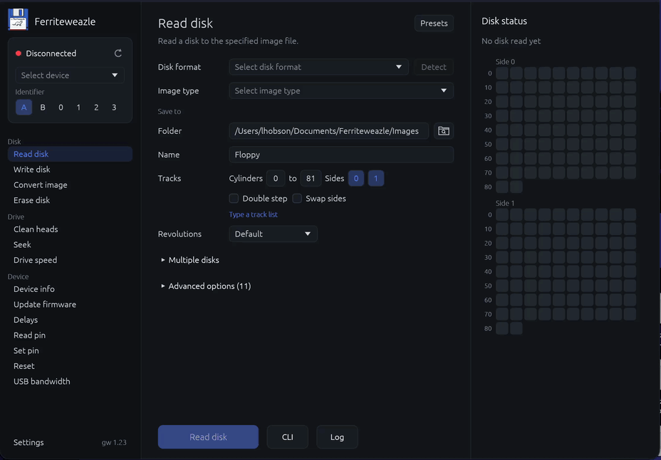

# Ferriteweazle

**GUI front end for [Greaseweazle](https://github.com/keirf/greaseweazle), Keir Fraser's floppy disk flux reader and writer, for macOS, Windows and Linux. Written in Rust.**



## What does it do?

- Feature parity with [Greaseweazle Tools](https://github.com/keirf/greaseweazle) by [Keir Fraser](https://github.com/keirf)
- macOS, Windows and Linux, x86-64 and ARM64
- Greaseweazle and Adafruit Feather RP2040 devices
- Format detection for disks and images
- Single and batch reads, writes and conversions
- Further read passes over tracks with sectors still missing after gw's retries
- Analyse: each side of the disk, track by track, with its sectors and flux as gw decoded them, and the image file as gw lays it out
- Log of gw's output, saved to a file on request
- Shows each action's gw command line, and passes extra arguments to gw
- Drag and drop of image files
- Tooltips on settings and options
- Confirmation before destructive actions
- Releases include [Greaseweazle Tools](https://github.com/keirf/greaseweazle), unmodified, with its Python; any other `gw` or `gw.exe` can be used instead

## How does it detect disk formats?

Greaseweazle Tools has no format detection, so Ferriteweazle uses gw's own codecs. It decodes both sides of cylinder 0 with every format gw knows, except the `.scan` ones, and keeps those that find every sector. Many formats pass, so it ranks them by how far each sector lies from where the format places it. Formats within 1% of the best that differ on a track not yet read have that track read, up to four more. Physical cylinder 2 shows whether a 40-track disk needs Step 2. Apple II formats differ only in sector order, so the filesystem decides: ProDOS or DOS 3.3.

Detection can be wrong: formats and image types are grouped for choosing one by hand.

## Why bundle Greaseweazle Tools in the releases?

Greaseweazle Tools is a command-line program that runs on Python. The packages include it, unmodified, with its own Python, so the app runs without [gw's installation steps](https://github.com/keirf/greaseweazle/wiki/Software-Installation).

**The bundled copy is optional.** Ferriteweazle can [use any installation of Greaseweazle Tools](https://github.com/keirf/greaseweazle/releases): set **Settings > Paths > Greaseweazle Tools (gw cli)** to its `gw` or `gw.exe`.

## Installing

Download the package for your system from the [latest release](https://github.com/hobbo91/Ferriteweazle/releases/latest).

### macOS

macOS 10.15 or newer, Apple Silicon or Intel.

1. Open [`Ferriteweazle-1.4.0-macos-universal.dmg`](https://github.com/hobbo91/Ferriteweazle/releases/download/v1.4.0/Ferriteweazle-1.4.0-macos-universal.dmg).
2. Drag **Ferriteweazle** to **Applications**.
3. Open Ferriteweazle. The app isn't notarised, so macOS blocks it the first time.
4. On macOS 15 or newer, open **System Settings > Privacy & Security** and click **Open Anyway**. On older versions, Control-click Ferriteweazle in **Applications**, choose **Open**, then **Open** again.

### Windows

Windows 10 or newer, x64 or ARM64.

1. Run [`Ferriteweazle-1.4.0-win-x64.msi`](https://github.com/hobbo91/Ferriteweazle/releases/download/v1.4.0/Ferriteweazle-1.4.0-win-x64.msi), or [`Ferriteweazle-1.4.0-win-arm64.msi`](https://github.com/hobbo91/Ferriteweazle/releases/download/v1.4.0/Ferriteweazle-1.4.0-win-arm64.msi) on an ARM PC.
2. If SmartScreen warns you, click **More info**, then **Run anyway**.
3. Follow the installer.

To run without installing, unzip [`Ferriteweazle-1.4.0-win-x64.zip`](https://github.com/hobbo91/Ferriteweazle/releases/download/v1.4.0/Ferriteweazle-1.4.0-win-x64.zip) or [`Ferriteweazle-1.4.0-win-arm64.zip`](https://github.com/hobbo91/Ferriteweazle/releases/download/v1.4.0/Ferriteweazle-1.4.0-win-arm64.zip) and run `Ferriteweazle.exe`.

### Linux

x86-64 or ARM64, glibc 2.17 or newer, under Wayland or X11, with Vulkan or OpenGL.

AppImage: [`Ferriteweazle-1.4.0-x86_64.AppImage`](https://github.com/hobbo91/Ferriteweazle/releases/download/v1.4.0/Ferriteweazle-1.4.0-x86_64.AppImage) or [`Ferriteweazle-1.4.0-aarch64.AppImage`](https://github.com/hobbo91/Ferriteweazle/releases/download/v1.4.0/Ferriteweazle-1.4.0-aarch64.AppImage)

```sh
chmod +x Ferriteweazle-1.4.0-x86_64.AppImage
./Ferriteweazle-1.4.0-x86_64.AppImage
```

The AppImage needs FUSE to start: `fusermount3` or `fusermount`, from your distribution's FUSE package (usually `fuse3`). Most desktops have it. If it says "Cannot mount AppImage, please check your FUSE setup", run it this way instead, or use the tarball, which needs no FUSE:

```sh
./Ferriteweazle-1.4.0-x86_64.AppImage --appimage-extract-and-run
```

Or the tarball: [`Ferriteweazle-1.4.0-linux-x86_64.tar.gz`](https://github.com/hobbo91/Ferriteweazle/releases/download/v1.4.0/Ferriteweazle-1.4.0-linux-x86_64.tar.gz) or [`Ferriteweazle-1.4.0-linux-aarch64.tar.gz`](https://github.com/hobbo91/Ferriteweazle/releases/download/v1.4.0/Ferriteweazle-1.4.0-linux-aarch64.tar.gz)

```sh
tar -xzf Ferriteweazle-1.4.0-linux-x86_64.tar.gz
./Ferriteweazle/ferriteweazle
```

On ARM, use the `aarch64` files in the commands.

File dialogs use your desktop's portal (`xdg-desktop-portal`), or `zenity` where there is none.

## Building

You need [Rust](https://rustup.rs) 1.95 or later.

```sh
git clone https://github.com/hobbo91/Ferriteweazle
cd Ferriteweazle
bundle/build.sh     # optional: gw with its own Python
cargo run --release
```

Without the bundle, the app uses an installed `gw`. `bundle/build.sh` needs curl, git and a C/C++ compiler: Xcode's command line tools on macOS, zig on Linux, and on Windows Visual Studio's C++ build tools and LLVM, in Git Bash.

Tests and packages: [BUILDING.md](BUILDING.md).

## Is this just vibe-coded AI slop?

No. I built it in Rust, a language I know well, using Claude as a coding assistant, and I review every change. I also contribute to [Copperline](https://github.com/CopperlineHQ/Copperline), [Coppersynth](https://github.com/CopperlineHQ/Coppersynth) and [FluxBridge](https://github.com/CopperlineHQ/FluxBridge).

## Licence

Ferriteweazle is MIT licensed and comes with no warranty; see [LICENSE](LICENSE). Greaseweazle Tools is by Keir Fraser and is in the public domain. Image any disk you care about before writing to it, and write-protect a disk you only want to read.
