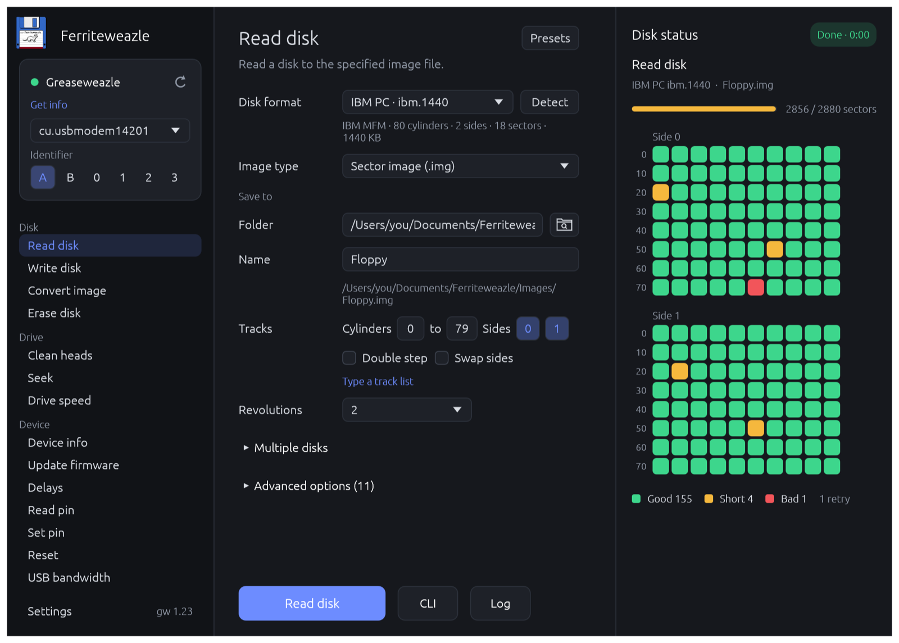

# Ferriteweazle


A desktop app for [Greaseweazle](https://github.com/keirf/greaseweazle), Keir Fraser's
floppy disk flux reader and writer. It runs on macOS, Windows and Linux.



## What it does

- Gives every `gw` command a page: read, write, convert, erase, clean, seek, drive
  speed, device info, firmware update, delays, pins, reset and bandwidth.
- Greys out the pages that need a Greaseweazle until one is connected.
- Offers every option of every command. Common options have their own controls; the
  others are under **Advanced options**.
- Finds the format of a disk. **Detect** decodes a few tracks of the disk in the
  drive, or of a flux image, with every format gw knows, and chooses the best
  match and the image type that suits it (Akai to .img, Amiga to .adf).
- Draws a disk map as gw works: a square per track, ten cylinders to a row.
- Shows gw's output from every job since the app opened, to copy, save or clear.
- Shows each page as its `gw` command line with **CLI**. Change either and the
  other follows. It takes only `gw` commands and runs nothing: the page's own
  button runs gw, with no shell.
- Reads a set of disks one after another into numbered files, asking for each.
- Asks before replacing a file.
- Shows the Greaseweazle's model and firmware as soon as it is connected.
- Saves images and presets in Documents/Ferriteweazle, under Images and Presets,
  or in folders chosen under **Settings > Paths**. Between runs it keeps only the
  window size, the drive and the device: every other setting starts afresh.
- Follows the system's light or dark mode, or keeps to either. Choosing one in
  Settings fades to it.
- Takes image files by drag and drop.
- Takes a disk definitions file of your own. gw's parser checks it line by line,
  and its formats come first in the format list.
- Can save gw's output beside each image, and play a sound when a job ends.
- Asks before closing while gw is working, and lets gw stop the drive first.

## How it keeps up with Greaseweazle

Ferriteweazle ships `gw` unmodified, with its own Python, so there is nothing else
to install.

At start-up a bridge ([`src/bridge.py`](src/bridge.py)) reads the commands and
options from gw's argument parsers, and the app builds its pages from them. A new
gw release works once it is bundled: its new options appear under **Advanced options**,
and options it drops disappear.

`engine/build.sh` bundles gw's latest release on GitHub, never a nightly build or a
prerelease. The packaging scripts rebuild the engine first when gw has a newer
release. To stay on one release, set `GREASEWEAZLE` in [`engine/versions`](engine/versions)
to its tag. `cargo build` never checks: a build script that went online would slow
every build and fail offline.

**Settings > Paths > gw** points the app at any installed `gw` instead, such as a
pipx install or a development checkout.

## How it finds a format

gw has no format detection of its own, so the bridge builds it from gw's codecs.
It decodes both sides of cylinder 0 with every format gw knows. It keeps those
that account for every sector on the disk. Many formats agree that far: in gw
1.23, 22 groups share sector IDs, sizes and data rate. gw's template for each
format places every sector, so the bridge ranks them by how far the sectors sit
from where each format writes them. That tells apart the index mark, interleave,
skew and gaps. Where the best still disagree about some track, such as a 40 or
80 track length or an unformatted track, it reads that track. Physical cylinder
2 shows whether a 40-track disk sits in an 80-track drive, which needs double
step. Apple II formats write the same disk, so its filesystem decides: ProDOS or
DOS 3.3.

## Building

You need Rust 1.95 or later. The app itself builds with `cargo` alone:

```sh
cargo run --release
```

It runs gw from the first of these it finds:

1. The engine in `target/engine`, if you built one (below).
2. An installed `gw`: on the PATH, or in `~/.local/bin`, `/opt/homebrew/bin` or
   `/usr/local/bin`.

**Settings > Paths > gw** points it at any other gw.

### The engine

`engine/build.sh` builds `target/engine`, the gw that packages ship: a standalone
Python from [python-build-standalone](https://github.com/astral-sh/python-build-standalone),
gw's latest release installed into it with pip, and the SPS/CAPS library, which gw
needs for IPF and CT Raw images, compiled from
[its source](https://github.com/simonowen/capsimage). The downloads are checked
against the hashes in `engine/`. The CAPS library's licence allows only
non-commercial use.

It needs curl, git, and C and C++ compilers:

- macOS: Xcode's command line tools.
- Windows, in Git Bash: Visual Studio's C++ build tools, and LLVM (clang++ and lld)
  for the CAPS library.
- Linux: [zig](https://ziglang.org), which builds gw's C code and the CAPS library
  for glibc 2.17.

```sh
engine/build.sh                          # this computer
engine/build.sh x86_64-apple-darwin      # another processor, run emulated
GREASEWEAZLE=v1.23 engine/build.sh       # a given gw release
```

To stay on one gw release, set `GREASEWEAZLE` in [`engine/versions`](engine/versions)
to its tag. `cargo build` never checks for a newer gw; the packaging scripts do,
and rebuild the engine first.

### Packages

Each script writes to `dist`, where `VERSION` is the one in `Cargo.toml`.

| Platform | Command | Packages |
| --- | --- | --- |
| macOS | `packaging/macos/bundle.sh` | `Ferriteweazle-VERSION-macos-universal.dmg` |
| Windows | `packaging/windows/bundle.sh x64` or `arm64` | `Ferriteweazle-VERSION-win-ARCH.zip` and `.msi` |
| Linux | `packaging/linux/bundle.sh x86_64` or `aarch64` | `Ferriteweazle-VERSION-linux-ARCH.tar.gz` and `Ferriteweazle-VERSION-ARCH.AppImage` |

**macOS.** One app for Apple Silicon and Intel Macs, macOS 10.15 or newer. It
needs rustup's stable toolchain with both Mac targets, and Rosetta to build the
Intel engine:

```sh
rustup target add aarch64-apple-darwin x86_64-apple-darwin
```

The app is signed ad hoc, so it opens on the Mac that built it. Signed and
notarised releases are still to do.

**Windows.** Windows 10 or newer. Run the script in Git Bash. It needs Rust's
`x86_64-pc-windows-msvc` and `aarch64-pc-windows-msvc` targets, Visual Studio's C++
build tools for the processor you build for, LLVM, and WiX 5, a .NET tool (install
the .NET 8 SDK first):

```sh
dotnet tool install --global wix --version 5.0.2
wix extension add --global WixToolset.UI.wixext/5.0.2
```

The zip holds a Ferriteweazle folder that runs where it is unzipped. The MSI
installs the same for all users, in Program Files or a folder chosen in the
installer. Keep the UpgradeCode in `packaging/windows/ferriteweazle.wxs`: Windows
Installer knows a new version of Ferriteweazle by it. Neither package is
code-signed yet, so SmartScreen warns about a downloaded copy.

**Linux.** glibc 2.17 or newer. It needs
[cargo-zigbuild](https://github.com/rust-cross/cargo-zigbuild) and zig, and
downloads appimagetool and the AppImage runtime at the versions
`packaging/linux/appimage.sha256` checks. Building for the other processor runs
its Python emulated, so pip can build gw for it: qemu-user with that processor's
libraries, or Rosetta in a Linux VM on a Mac.

**All at once.** `packaging/release.sh`, on a Mac, builds every package of the
commit checked out: the macOS one there, the Windows and Linux ones over SSH on
the machines named in `packaging/release.env` (copy
`packaging/release.env.example`). It adds the source of the LGPL code in the Linux
packages, the CAPS library's source, and `Ferriteweazle-VERSION-SHA256SUMS.txt`,
which the app's Update checks downloads against.

## Tests

```sh
cargo test                                   # unit, window and end-to-end tests
cargo test --test screens -- --ignored       # draws the window to target/screens
```

The end-to-end tests run real `gw` conversions through the bridge. They skip
when there is no Greaseweazle install. No test opens a device.

## Licence

Ferriteweazle is MIT licensed. Greaseweazle is by Keir Fraser and is in the public
domain.
